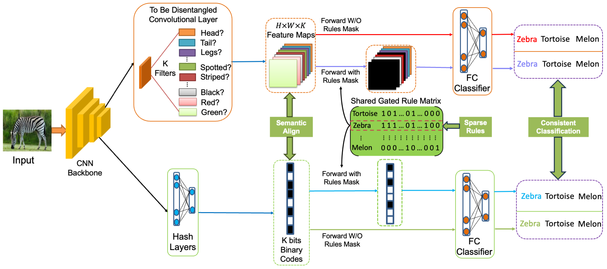

# IBC
Official Pytorch implementation of "Learning interpretable binary codes for customized image retrieval".

The framework of our proposed method IBC:



## Requirements

Please prepare the requirements by following the command.
```
pip install -r requirements.txt
```

## Train IBC models
### Prepare datasets
We use public benchmark datasets: a subset of ImageNet, ImageNet-150K, and SUN-120K. We have preprocessed these three 
datasets and provided both the raw images and the annotations files for direct training and testing. You can 
download them from [Baidu Cloud Drive](https://pan.baidu.com/s/1kTD5MFVfeaFyXh_n0_sm6Q) using the extraction codes：ibcc. 
The pretrained weights file for initializing the training on the SUN-120K dataset is also included in the provided 
SUN-120K dataset (file path: SUN_attributes/pretrained_model/alexnet_places365.pth.tar).
In the future, we will provide a download link on Google Drive.

The training and testing settings on each dataset with different code lengths are shown in the configs folder, i.e., 
imagenet100.yaml, imagenet.yaml and sun_attr.yaml. You should change some settings such as the 'model_name', 
'code_len', 'class_num', paths of files when training different models.


Examples
- Train the IBC model with ImageNet-150K.
- ```
  python train.py --config=./configs/imagenet.yaml
  ``` 

- Train the IBC model with ImageNet-100C.
- ```
  python train.py --config=./configs/imagenet100.yaml
  ``` 

- Train the IBC model with SUN-120K.
- ```
  python train.py --config=./configs/sun_attr.yaml
  ``` 


## Evaluation
### Binary codes extraction 
- ```
  python fea_extraction.py --config=./configs/imagenet.yaml --checkpoint=./outputs/model_name/checkpoints/checkpoint_80000.pt --save_name feature_file_name
  ``` 
>>This operation will help you obtain the binary codes and annotations of the test set in the format of .mat (Matlab).

### Quantitative evaluation
- Mutual information score (MIS) of binary codes
- ```
  python compute_mutual_info_offline.py --class_num=100 --fea_dim=256 --sample_num=5000 --fea_file_path=/path/to/binary codes file --label_file_path=/path/to/annotation file --is_mat_file --is_sun?
  ```


- Image retrieval mAP

>>We provide the Matlab evaluation codes for each dataset to compute the class-level retrieval, expert-bit class retrieval, 
and attribute retrieval (only for SUN-120K) mAP, which are 'dataset_name'_eval.m. Besides, before using customized bits
for a target attribute retrieval, you need to use the simultaneously provided [NetDissect-Lite](https://github.com/ssqiao/IBC/tree/main/NetDissect-Lite-release-with-IBC) tool to dissect the 
pretrained IBC model to obtain the indexes of used bits (interpreted filters' indexes) with similar semantic
meaning of that target attribute. 

- Network dissection tool usage

>>Change the directory to [NetDissect-Lite](https://github.com/ssqiao/IBC/tree/main/NetDissect-Lite-release-with-IBC), modify 
 settings of the model name, file paths, and so on in the settings.py, and run the following command:
- ```
  python main.py
  ```

### Pretrained 256-bit IBC models

We release our pretrained 256-bit models and extracted binary codes for reference on the [Baidu Cloud Drive](https://pan.baidu.com/s/1sjtE4WHCtUWm00n7XdVxAA) with extraction codes: ibcc.
Please note that the extracted binary codes contain two files on ImageNet-150K, one of which named with 'val50000' is 
used for computing the MIS, while the other one is used for retrieval mAP evaluation.

## Contact
If you have any problem with our code, feel free to contact [shishi.qiao@vipl.ict.ac.cn](mailto:shishi.qiao@vipl.ict.ac.cn),
 [qiaoshishi@ouc.edu.cn](mailto:qiaoshishi@ouc.edu.cn)
or describe your problem in Issues.


